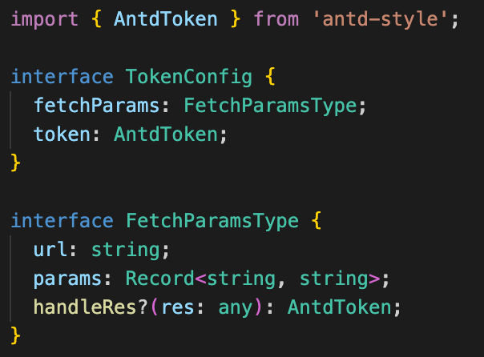

# antd design token

VSCode extension for antd v5 design token.

## Features

在 antd Design Token 插件基础上进行了如下修改:

1.支持从本地的 token.config.ts 或 token.config.js 文件读取自定义 token 配置 2.更改了插件生效条件

token.config.ts 文件中会读取默认导出的对象，token.config.js 文件会读取变量名为 tokenConfig 的对象，对象的格式如下:

会将原始 token，本地 token，请求 token 进行合并，优先级顺序为（请求 token>本地 token>原始 token）,使用合并后的对象进行代码补全

Provide the hover hint and editor decorations of antd v5 design token, include `color`, `value`:

Support completion for antd v5 design token value on typing. Note that for sorting, you can type an `a` before typing the token. For example, if you want to type `margin...`, you can type `amargin...`. Which will not affect the variable inserted after the enter keydown.

Sort by token value:

## Commands

You can use command: `antd-design-token:toggle` to active or inactive this extension.
